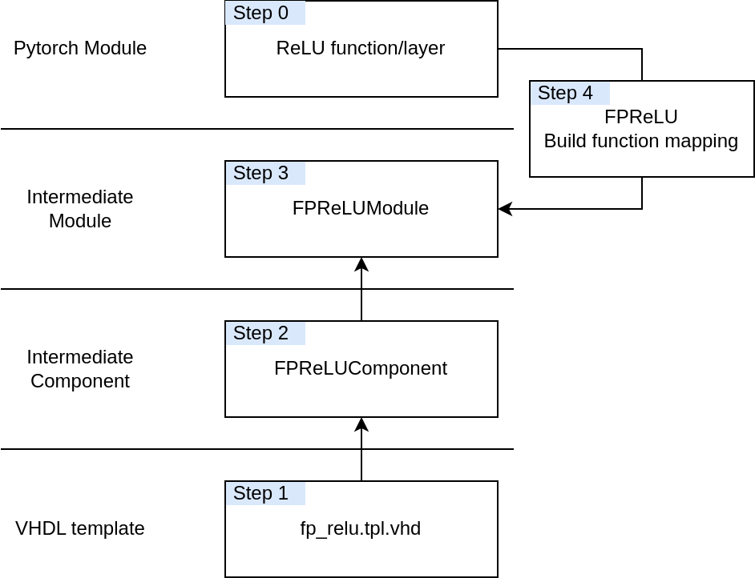

# Adding Components
This document describe how I understand the steps of adding a HW components to the Creator.

---

## The interface of the activation functions

- We must determine the equivalent PyTorch module that we want to add
    - e.g., we want to have a hardware ReLU component that supports fixed point data
        + and in this case, we only need to understand the behaviour of ReLU
        + Fixed-Point is more like an additional requirement to the HW side than to the PyTorch side
        + This means we can just determine the torch.nn.ReLU is the module that we want to translate
- Then we need to create the HW component `fp_relu.tpl.vhd`,
    - To do so, I prefer just to create the `fp_relu.vhd` as I did in the current repository, see [here](https://github.com/SuperChange001/HWLib/blob/master/source/fp_relu.vhd)
    - Plus the corresponding testbench to cover the behaviour test, see [here](https://github.com/SuperChange001/HWLib/blob/master/testbench/fp_linear_1d_tb.vhd)
    - Once previous two steps has been done, we can create the template file based on `fp_relu.vhd`
- Then we need to create the class (FPReLUComponent) in the creator
- Then we need to create another class (FPReLUModule) in the creator
- The last step is to create the building function that maps the PyTorch module to our abstract module
- Finally, don't forget to add corresponding tests in the creator!

---
**Comment**: I notice this description is not detailed enough, and maybe even confuse you more. I will keep adding more details and you are welcome to leave your feedback and suggestion!
