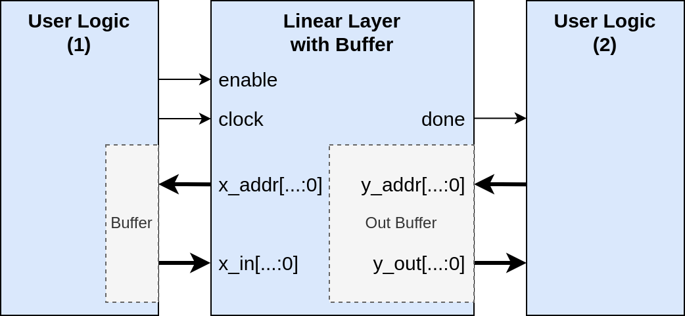

# Interface definition
To plan and unify the interface of all hardware components, this document is applied for documenting the interfaces of all HW components. In the short future, we will also include how to stack components together.
---

## The interface of the activation functions
Activation functions are relatively simpler than other Deep Learning (DL) components. Thus it needs at most 4 ports, `enable`, `clock`, `input`, and `output`, while `enable` and `clock` are optional and only depend on the implementation, but to unify the interface of all activation functions we always create these two ports. Figure below shows the interface of our activation functions:

Please note that, during the sythesis (similar to compiling) process, these ports will be eliminated automatically by the EDA tool.

## The interface of the Linear Layer with Buffer
- The linear layer contains weights and biases. Thus we don't need additional ports for weights and biases
- To avoid the overhead of buffers, the linear layer only hosts one output buffer, while the user logic should take care of its input buffer.
- Moreover, we assume the input data are stored in a 1D array, and the `x_in` is updated at the rising edge of the clock signal.
- Similarly, the `y_out` is updated according to the `y_addr` when the clock signal arises.
