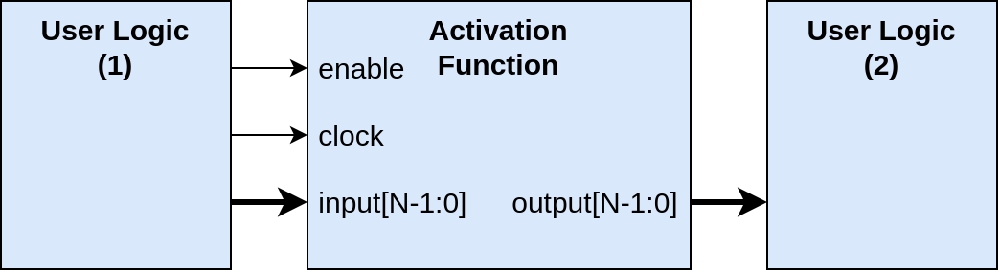

# Interface definition
To plan and unify the interface of all hardware components, this document is applied for documenting the interfaces of all HW components. In the short future, we will also include how to stack components together.
---

## The interface of the activation functions
Activation functions are relatively simpler than other Deep Learning (DL) components. Thus it needs at most 4 ports, `enable`, `clock`, `input`, and `output`, while `enable` and `clock` are optional and only depend on the implementation, but to unify the interface of all activation functions we always create these two ports. Figure below shows the interface of our activation functions:

Please note that, during the sythesis (similar to compiling) process, these ports will be eliminated automatically by the EDA tool.