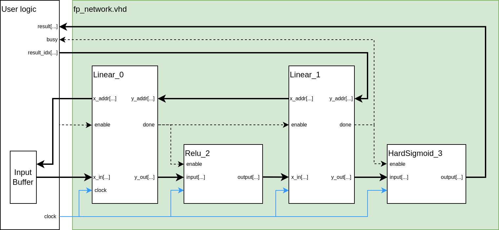

> This folder contains the prototype of my network layer design and its dependencies

# File structure
```
.
├── 0_FixedPointLinear
│   ├── b_rom_fp_linear_1d_0.vhd
│   ├── fp_linear_1d_0.vhd
│   └── w_rom_fp_linear_1d_0.vhd
├── 1_FixedPointLinear
│   ├── b_rom_fp_linear_1d_1.vhd
│   ├── fp_linear_1d_1.vhd
│   └── w_rom_fp_linear_1d_1.vhd
├── 2_FixedPointHardSigmoid
│   └── fp_hard_sigmoid_2.vhd
├── 3_FixedPointReLU
│   └── fp_relu_3.vhd
├── fp_network.vhd
└── README.md
```

The `fp_network.vhd` is the design of the network layer, at the moment is hand written. We plan to make this component auto generated according the network structure defined in pytorch. The other folders are the components in side the neural network, each folder contains one main component and sometimes with it own dependent memory components.They all generated by the creator.

## Design rules of the network layer
1. Block diagram of the network layer


2. What should be optimized before we auto-generating the network layer
    - [ ] we need to pass a list of the components(layers) that should be instantiated in the network layer. In this case, the list should contain something like `{linear_0, linear_1, hard_sigmoid_3, relu_2}`.
    - [ ] relationship between components should also be passed into this network layer. In this case, the relationship should be something like `linear_0 -> relu_2 -> linear_1 -> hard_sigmoid_3`
    - [ ] according to the input information, 
        - [ ] now the code generator should first instantiate all necessary components
        - [ ] then connect their ports according to the relationship.